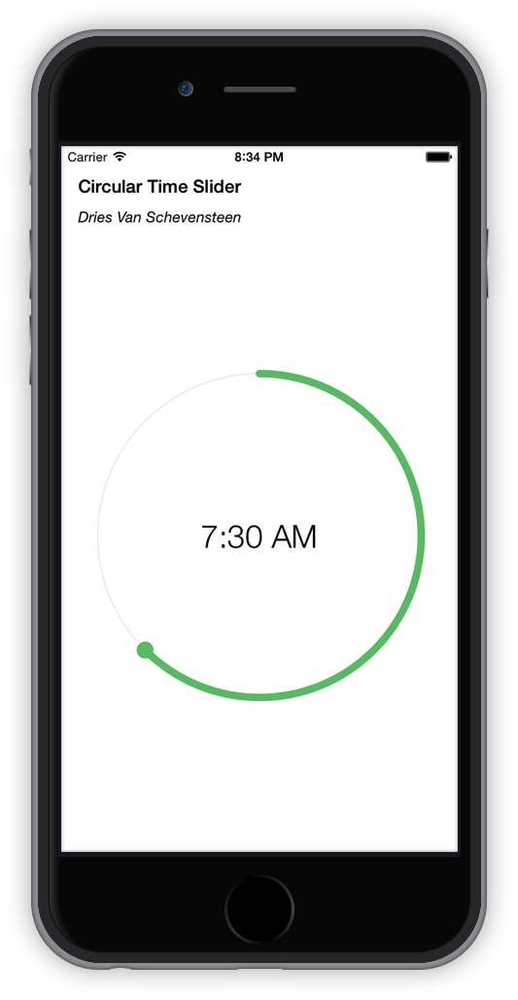

# DVSCircularTimeSlider

## What is this?
DVSCircularTimeSlider is a circular slider control made for easily adjusting the time, written in Swift. It shows a minimalist circle which the user can adjust with the handle. Works in both landscape and portrait mode.



## Installation
Download the repository and simply drag `DVSCircularTimeSlider.swift` in your project.

## Usage
* Add a UIView to your ViewController
* Use constraints with a preferred aspect ratio of 1:1
* Set the class of the UIView in the Identity Inspector to `DVSCircularTimeSlider`
* Create an outlet
* Add a target for the action triggered when time changes
```
slider.addTarget(self, action: "circularTimeSliderValueChanged:", forControlEvents: .ValueChanged)
```
* Add a function for the target
```
func circularTimeSliderValueChanged(slider: DVSCircularTimeSlider) {
    println("Current time: \(slider.timeString)")
}
```

## properties

Below is a list of all properties you can set, some of them are `@IBInspectable` so you also can adjust these in Interface Builder

| Property      | Info          | `@IBInspectable`    |
| ------------- | ------------- | :-------------: |
| primaryCircleColor | UIColor object used to set the color of the arc and handle indicating the time | Yes |
| primaryCircleStrokeSize | CGFloat that sets the stroke size of the time indicating arc | Yes |
| primaryCircleHandleRadius | CGFloat that sets the handle size of the time indicating circle | Yes |
| shadowCircleColor | UIColor object that sets the color of the background circle behind the time indicating arc | Yes |
| shadowCircleStrokeSize | CGFloat that sets the stroke size of the background circle | Yes |
| fontSize | CGFloat that sets font size of time indicating label | |
| fontName | String that sets the font type of the time indicating label | |
| time | NSDate that stores the time, the date portion is obsolete and not taken into account | |
| timeString | Readonly property that returns a string from the time property | &nbsp; |

### Example

```
slider.primaryCircleColor = UIColor(red: 242/255, green: 94/255, blue: 94/255, alpha: 1.0)
slider.primaryCircleStrokeSize = 5
slider.primaryCircleHandleRadius = 15
slider.shadowCircleColor = UIColor(red: 242/255, green: 242/255, blue: 242/255, alpha: 1.0)
slider.shadowCircleStrokeSize = 3

slider.fontSize = 40
slider.fontName = "HelveticaNeue-UltraLight"

let cal = NSCalendar(identifier: NSCalendarIdentifierGregorian)
let components = NSDateComponents()
components.hour = 7
components.minute = 30
if let date = cal?.dateFromComponents(components) {
  slider.time = date
}
```

## Author
Dries Van Schevensteen, van.schevensteen.dries@gmail.com

## Licence
Copyright © 2015 Dries Van Schevensteen

Permission is hereby granted, free of charge, to any person obtaining a copy of this software and associated documentation files (the “Software”), to deal in the Software without restriction, including without limitation the rights to use, copy, modify, merge, publish, distribute, sublicense, and/or sell copies of the Software, and to permit persons to whom the Software is furnished to do so, subject to the following conditions:

The above copyright notice and this permission notice shall be included in all copies or substantial portions of the Software.

THE SOFTWARE IS PROVIDED “AS IS”, WITHOUT WARRANTY OF ANY KIND, EXPRESS OR IMPLIED, INCLUDING BUT NOT LIMITED TO THE WARRANTIES OF MERCHANTABILITY, FITNESS FOR A PARTICULAR PURPOSE AND NONINFRINGEMENT. IN NO EVENT SHALL THE AUTHORS OR COPYRIGHT HOLDERS BE LIABLE FOR ANY CLAIM, DAMAGES OR OTHER LIABILITY, WHETHER IN AN ACTION OF CONTRACT, TORT OR OTHERWISE, ARISING FROM, OUT OF OR IN CONNECTION WITH THE SOFTWARE OR THE USE OR OTHER DEALINGS IN THE SOFTWARE.
